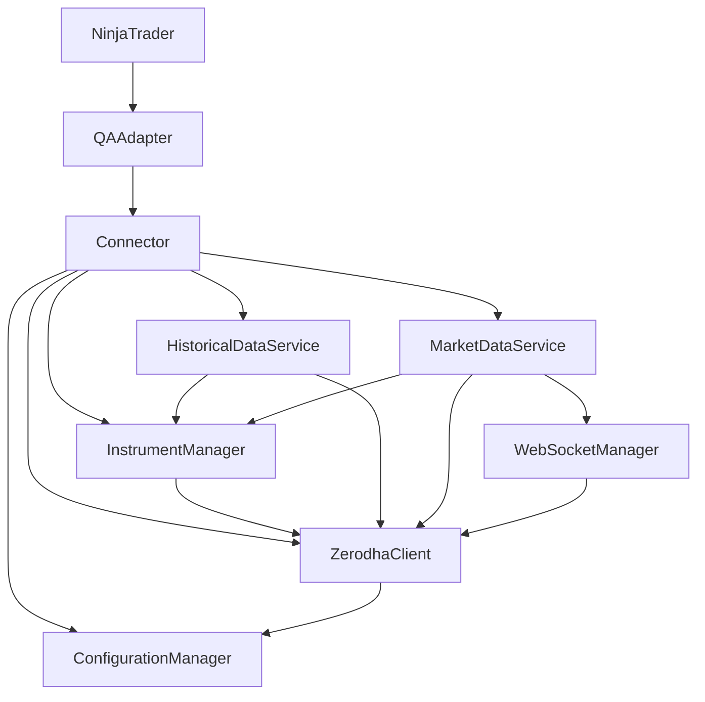

# QANinjaAdapter Architecture Document

## Overview

This document describes the architecture of the QANinjaAdapter, which serves as a bridge between NinjaTrader and the Zerodha trading platform. The adapter enables NinjaTrader to connect to Zerodha's API for market data, historical data, and trading operations.

## Architectural Goals

The primary goals of the refactoring were:

1. **Modularity**: Break down the monolithic Connector class into smaller, focused components
2. **Maintainability**: Improve code organization and readability
3. **Extensibility**: Make it easier to add new features or modify existing ones
4. **Testability**: Facilitate unit testing by having clear component boundaries

## System Architecture

The refactored architecture follows a service-oriented approach, with each service responsible for a specific aspect of the adapter's functionality. The main components are:

### Core Components

1. **Connector**: The main entry point that orchestrates the interaction between NinjaTrader and the various services
2. **QAAdapter**: The NinjaTrader adapter implementation that connects to the Connector

### Services

The functionality has been divided into the following services:

#### 1. Configuration Management

**ConfigurationManager** (`Services/Configuration/ConfigurationManager.cs`)
- Responsible for loading and managing configuration settings
- Handles API keys, access tokens, and broker settings
- Provides a centralized access point for configuration data

#### 2. Zerodha API Client

**ZerodhaClient** (`Services/Zerodha/ZerodhaClient.cs`)
- Handles communication with the Zerodha API
- Manages authentication and connection status
- Provides methods for creating authorized HTTP clients

#### 3. Instrument Management

**InstrumentManager** (`Services/Instruments/InstrumentManager.cs`)
- Manages instrument creation, mapping, and retrieval
- Handles loading instrument tokens from Zerodha
- Provides methods for registering symbols in NinjaTrader

#### 4. Market Data Services

**HistoricalDataService** (`Services/MarketData/HistoricalDataService.cs`)
- Retrieves historical data from Zerodha
- Processes and formats historical data for NinjaTrader

**MarketDataService** (`Services/MarketData/MarketDataService.cs`)
- Handles real-time market data subscriptions
- Processes tick data and market depth data
- Manages WebSocket subscriptions for real-time data

#### 5. WebSocket Management

**WebSocketManager** (`Services/WebSocket/WebSocketManager.cs`)
- Manages WebSocket connections to Zerodha
- Handles connection lifecycle (connect, subscribe, unsubscribe, close)
- Provides methods for parsing binary messages from WebSockets

## Component Interactions

The following diagram illustrates the interactions between the components:

## Data Flow

### Market Data Flow

1. NinjaTrader requests market data through QAAdapter
2. QAAdapter forwards the request to Connector
3. Connector delegates to MarketDataService
4. MarketDataService uses InstrumentManager to get the instrument token
5. MarketDataService uses WebSocketManager to establish a WebSocket connection
6. WebSocketManager uses ZerodhaClient to get the WebSocket URL and authentication
7. MarketDataService processes incoming data and forwards it to NinjaTrader

### Historical Data Flow

1. NinjaTrader requests historical data through QAAdapter
2. QAAdapter forwards the request to Connector
3. Connector delegates to HistoricalDataService
4. HistoricalDataService uses InstrumentManager to get the instrument token
5. HistoricalDataService uses ZerodhaClient to make HTTP requests for historical data
6. HistoricalDataService processes the data and returns it to NinjaTrader

## Design Patterns

The refactored architecture employs several design patterns:

1. **Singleton Pattern**: Each service is implemented as a singleton to ensure a single instance throughout the application
2. **Facade Pattern**: The Connector class serves as a facade, providing a simplified interface to the complex subsystems
3. **Dependency Injection**: Services are injected into the Connector, allowing for easier testing and flexibility
4. **Repository Pattern**: InstrumentManager acts as a repository for instruments, abstracting the data access

## Benefits of the New Architecture

1. **Reduced Complexity**: Each component has a clear, focused responsibility
2. **Improved Maintainability**: Smaller, more focused classes are easier to understand and modify
3. **Better Testability**: Components can be tested in isolation
4. **Enhanced Extensibility**: New features can be added by extending existing services or adding new ones
5. **Clearer Dependencies**: The relationships between components are explicit and well-defined

## Future Improvements

1. **Dependency Injection Framework**: Implement a proper DI framework to manage component lifecycles
2. **Logging Enhancements**: Implement structured logging across all components
3. **Error Handling Strategy**: Develop a consistent error handling and recovery strategy
4. **Configuration Management**: Enhance configuration management with validation and hot-reloading
5. **Unit Tests**: Add comprehensive unit tests for each component
