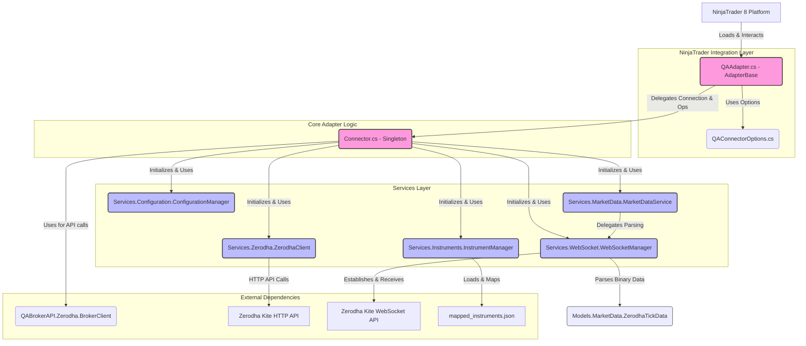

# QANinjaAdapter Architecture Document

## 1. Overview

The QANinjaAdapter is a custom NinjaTrader adapter designed to integrate with Zerodha's Kite Connect API. It enables users to receive real-time market data (tick and market depth), manage instrument subscriptions, and potentially handle order execution (though order execution aspects were not deeply reviewed in this pass) directly within the NinjaTrader 8 platform.

The architecture is modular, with distinct services for configuration management, instrument handling, market data processing, WebSocket communication, and direct API interaction with Zerodha.

## 2. Core Components and Flow

### 2.1. NinjaTrader Integration Layer

*   **`QAAdapter.cs`**: 
    *   The main entry point and integration bridge with NinjaTrader. Inherits from `AdapterBase`.
    *   Manages the connection lifecycle (`Connect`, `Disconnect`).
    *   Handles instrument resolution and subscriptions for market data (`SubscribeMarketData`, `SubscribeMarketDepth`).
    *   Stores L1 (tick) and L2 (depth) subscription details.
    *   Delegates provider-specific operations to `Connector.cs`.
    *   Utilizes `QAConnectorOptions` for user-configurable settings.

*   **`QAConnectorOptions.cs`**: 
    *   Defines the configuration settings exposed in the NinjaTrader "Connections" UI (e.g., Server Address, Port, Log Level).
    *   Specifies `QAAdapter` as the adapter class type.

### 2.2. Core Adapter Logic

*   **`Connector.cs` (Singleton)**:
    *   Acts as a central coordinator and service locator.
    *   Initializes and provides access to various services (`ConfigurationManager`, `ZerodhaClient`, `InstrumentManager`, `MarketDataService`, `WebSocketManager`).
    *   Manages the `BrokerClient` instance (from `QABrokerAPI`), which is the low-level client for Zerodha API communication.
    *   Checks connection status by delegating to `ZerodhaClient`.
    *   Handles symbol registration via `InstrumentManager`.

### 2.3. Services Layer

*   **`Services.Configuration.ConfigurationManager` (Singleton)**:
    *   Loads and provides access to API keys, access tokens, and other configuration settings (likely from a local file, e.g., `config.json` - though the exact file wasn't explicitly reviewed, this is typical).

*   **`Services.Zerodha.ZerodhaClient` (Singleton)**:
    *   Manages direct HTTP communication with the Zerodha Kite REST API.
    *   Handles authentication (API key, access token) for HTTP requests.
    *   Provides a `CheckConnection()` method to validate API connectivity (typically by hitting a profile endpoint).
    *   Constructs the WebSocket URL required by `WebSocketManager`.

*   **`Services.Instruments.InstrumentManager` (Singleton)**:
    *   Responsible for loading instrument definitions and mappings, primarily from `mapped_instruments.json`.
    *   Maps NinjaTrader symbols to Zerodha instrument tokens and vice-versa.
    *   Provides instrument details, including the `segment` (e.g., NSE, NFO, MCX).
    *   **Recent Change**: Modified to include `_tokenToInstrumentDataMap` and `GetSegmentForToken(long token)` method to allow `MarketDataService` to fetch segment information using the instrument token. This is crucial for MCX-specific parsing logic.

*   **`Services.MarketData.MarketDataService` (Singleton)**:
    *   Manages the overall flow of incoming market data from the WebSocket.
    *   Subscribes to ticks/depth via `WebSocketManager` (implicitly, by receiving data from it).
    *   **Recent Change**: In `SubscribeToTicks` and `ProcessDepthPacket`, it now calls `_instrumentManager.GetSegmentForToken()` to determine if an instrument belongs to the MCX segment. It passes an `isMcxSegment` boolean to `WebSocketManager.ParseBinaryMessage()`.
    *   Delegates the parsing of raw binary messages to `WebSocketManager.ParseBinaryMessage()`.
    *   Transforms parsed `ZerodhaTickData` into NinjaTrader market data updates.

*   **`Services.WebSocket.WebSocketManager` (Singleton)**:
    *   Handles the WebSocket connection lifecycle (connect, disconnect, message handling) with Zerodha's Kite WebSocket API.
    *   Receives raw binary market data packets.
    *   `ParseBinaryMessage(byte[] data, int expectedToken, string nativeSymbolName, bool isMcxSegment)`:
        *   Parses the binary data into a structured `Models.MarketData.ZerodhaTickData` object.
        *   Distinguishes between different packet modes (LTP, Quote, Full) based on packet length.
        *   **Recent Change**: Modified to accept `isMcxSegment` boolean. If `true`, it ensures that even if a full 184-byte packet is received, parsing is capped at the 44-byte "quote" mode structure, effectively ignoring the additional depth data for MCX instruments as per requirements.

### 2.4. Data Models

*   **`Models.MarketData.ZerodhaTickData.cs`**: 
    *   A C# class representing a single market data update (tick).
    *   Contains fields for Last Traded Price, Quantity, Volume, OHLC, Open Interest, Exchange Timestamp, and up to 5 levels of market depth (Bid/Ask).
    *   Populated by `WebSocketManager.ParseBinaryMessage()`.

*   **`InstrumentData` (within `InstrumentManager.cs`)**: 
    *   Represents the structure of entries in `mapped_instruments.json`, holding instrument token, symbol, segment, exchange, etc.

### 2.5. External Dependencies / Data Files

*   **Zerodha Kite HTTP API**: Used for authentication, fetching instrument lists (potentially), user profile information, and historical data.
*   **Zerodha Kite WebSocket API**: Used for receiving real-time market data.
*   **`mapped_instruments.json`**: A crucial JSON file (located in `Documents\NinjaTrader 8\QAAdapter\`) that contains the mapping between instrument symbols, Zerodha instrument tokens, segments, and other relevant details. This file is loaded by `InstrumentManager`.
*   **`QABrokerAPI.dll`**: A library (presumably custom or third-party) that provides the `BrokerClient` used for lower-level communication with Zerodha. This includes the `ClientConfiguration` for setting up API keys.

## 3. Data Flow for Real-time Market Data

1.  **Subscription Request (NinjaTrader -> QAAdapter)**:
    *   User subscribes to an instrument in NinjaTrader.
    *   `QAAdapter.SubscribeMarketData()` is called.
    *   A subscription request is created/updated in `_l1Subscriptions` (or `_l2Subscriptions` for depth).

2.  **Subscription to WebSocket (QAAdapter -> MarketDataService -> WebSocketManager -> Zerodha)**:
    *   `MarketDataService.SubscribeToTicks()` (or a similar method for depth) is invoked.
    *   `InstrumentManager.GetInstrumentToken()` retrieves the token for the symbol.
    *   `WebSocketManager` is instructed to subscribe to the specific instrument token(s) on the Zerodha WebSocket feed. (This step is more about ensuring the WebSocket is listening for these tokens rather than sending explicit per-token subscribe messages after initial connection, as per typical Kite Connect WebSocket behavior).

3.  **Data Reception (Zerodha -> WebSocketManager)**:
    *   `WebSocketManager` receives a binary data packet from the Zerodha WebSocket.

4.  **Data Parsing & Processing (WebSocketManager -> MarketDataService)**:
    *   The binary data packet is passed from the WebSocket receive loop to `MarketDataService`.
    *   `MarketDataService` calls `_instrumentManager.GetSegmentForToken(token)` to get the segment.
    *   `MarketDataService` then calls `_webSocketManager.ParseBinaryMessage(rawData, token, symbolName, isMcxSegment)`.
    *   `WebSocketManager.ParseBinaryMessage()`:
        *   Reads the instrument token from the packet.
        *   Determines packet mode (LTP, Quote, Full).
        *   **If `isMcxSegment` is `true` and packet is 184 bytes, it treats it as a 44-byte quote packet.**
        *   Parses fields into a `ZerodhaTickData` object.

5.  **Data Update to NinjaTrader (MarketDataService -> QAAdapter -> NinjaTrader)**:
    *   The populated `ZerodhaTickData` object is returned to `MarketDataService`.
    *   `MarketDataService` processes this tick (e.g., converts timestamps, prepares data for NinjaTrader format).
    *   It then invokes the callback provided by `QAAdapter` during the initial subscription (`l1Subscription.L1Callbacks.Keys[index].UpdateMarketData(...)`).
    *   `QAAdapter` updates NinjaTrader with the new market data (Last, Bid, Ask, Volume, etc.).

## 4. Configuration Flow

1.  User configures connection settings in NinjaTrader UI (`QAConnectorOptions`).
2.  `QAAdapter` receives these options.
3.  `Connector` initializes `ConfigurationManager`.
4.  `ConfigurationManager` loads API keys and access token from a persistent store (e.g., JSON file).
5.  These credentials are used by `ZerodhaClient` for HTTP API calls and by `WebSocketManager` (via `ZerodhaClient.GetWebSocketUrl()`) for WebSocket authentication.

## 5. Key Recent Modifications (MCX Instrument Handling)

*   **`InstrumentManager.cs`**: Added `GetSegmentForToken(long token)` and the internal `_tokenToInstrumentDataMap` to facilitate easy lookup of an instrument's segment using its token.
*   **`MarketDataService.cs`**: Modified `SubscribeToTicks` and `ProcessDepthPacket` to fetch the instrument's segment using `InstrumentManager.GetSegmentForToken()`. An `isMcxSegment` boolean flag is then passed to `WebSocketManager.ParseBinaryMessage()`.
*   **`WebSocketManager.cs`**: The `ParseBinaryMessage` method now accepts an `isMcxSegment` parameter. If this is true, and a 184-byte "full" mode packet is received for an MCX instrument, the parsing logic is deliberately restricted to only process the first 44 bytes (equivalent to "quote" mode), thus aligning with the specified requirement for MCX data handling.

This architecture allows for a clear separation of concerns, making the adapter more maintainable and extensible.
